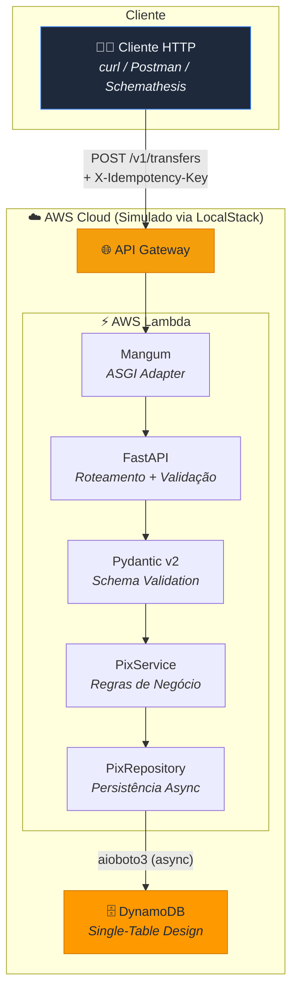
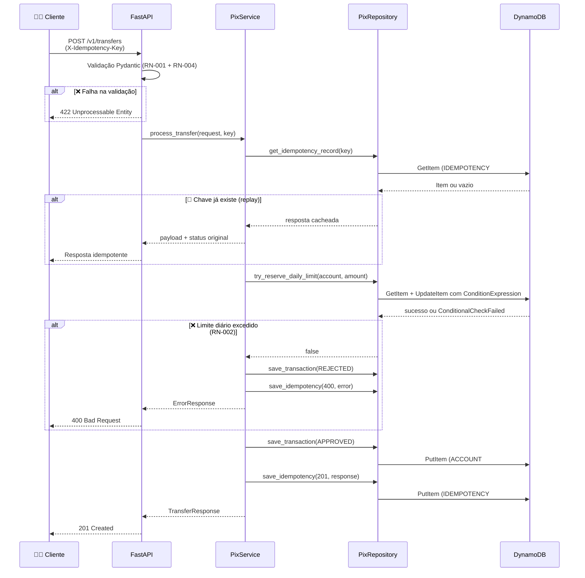
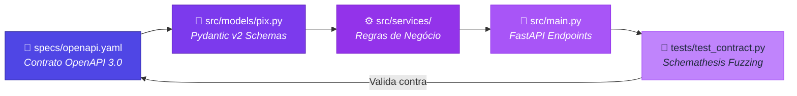
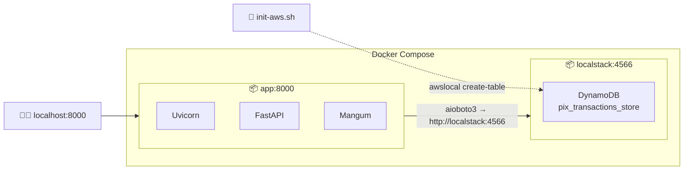
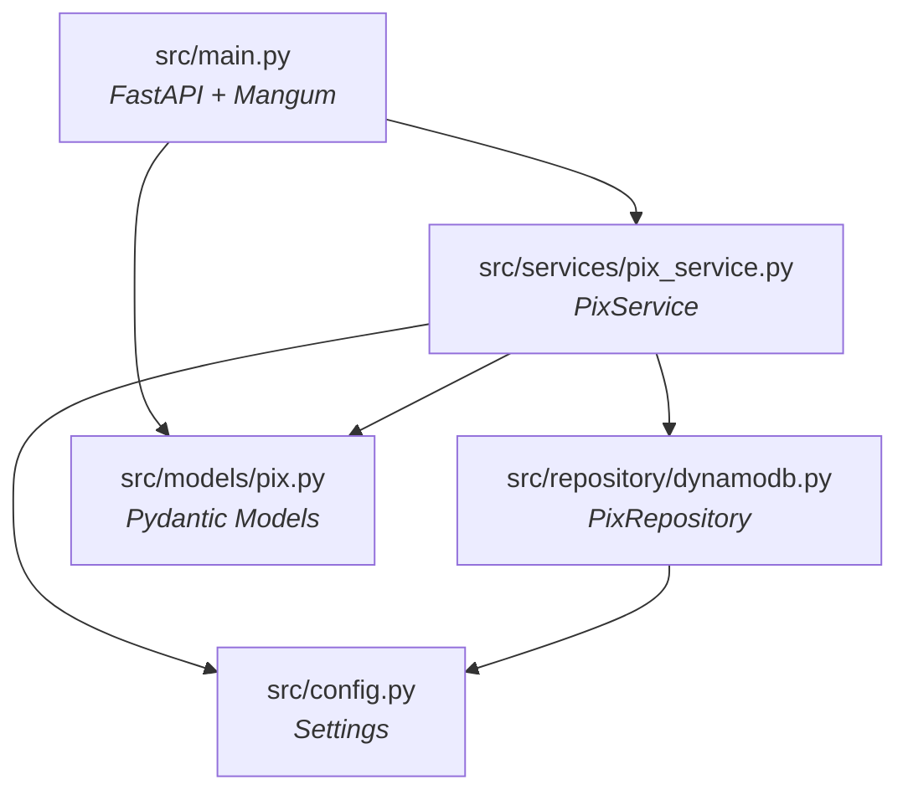

# 🏦 Pix Authorizer SDD

<p align="center">
  
  
  
  
  
</p>

O **Pix Authorizer Service** é um microsserviço de alta performance construído seguindo a abordagem **Spec-Driven Development (SDD)** (Desenvolvimento Orientado a Especificação). Ele atua como um gateway de autorização rápida para transações PIX, validando contratos OpenAPI, aplicando regras de idempotência estrita e controlando limites operacionais diários de forma atômica antes que as transações atinjam os sistemas legados de liquidação bancária.

---

## 1. Regras de Negócio (Business Rules)

| ID | Regra de Negócio | Ação em caso de violação | Código HTTP |
| :--- | :--- | :--- | :--- |
| **RN-001** | **Limite por Transação:** O valor individual da transferência não pode exceder **R$ 5.000,00**. | Rejeição imediata por validação de contrato. | `422 Unprocessable Entity` |
| **RN-002** | **Limite Acumulado Diário:** O somatório das transações aprovadas de uma conta no mesmo dia civil não pode ultrapassar **R$ 20.000,00**. | Recusa da transação com mensagem de limite excedido. | `400 Bad Request` |
| **RN-003** | **Idempotência Estrita:** Toda requisição exige o cabeçalho HTTP `X-Idempotency-Key` (UUIDv4). Chaves repetidas retornam exatamente a mesma resposta original. | Retorno da resposta em cache, sem novo débito ou processamento. | Mesmo status original |
| **RN-004** | **Validação de Chave PIX:** A chave receptora deve pertencer a uma das categorias válidas: `CPF`, `CNPJ`, `EMAIL`, `PHONE` (E.164) ou `EVP` (aleatória). | Rejeição por validação de contrato. | `422 Unprocessable Entity` |

---

## 2. Arquitetura de Alto Nível

O fluxo completo, desde a chamada do cliente HTTP (ou a suíte de testes do Schemathesis) até a persistência no banco de dados, é mapeado a seguir:



---

## 3. Fluxo de Execução da Transação

A lógica interna da API executa validações em camadas (contrato, idempotência, limites operacionais e concorrência) de forma coordenada:



---

## 4. Modelagem de Dados: Single-Table Design

Para otimizar o tempo de resposta e garantir consistência na simulação serverless com o AWS DynamoDB, o projeto utiliza a estratégia de **Tabela Única (Single-Table Design)**:

```mermaid
erDiagram
    PIX_TRANSACTIONS_STORE {
        string PK PK "Partition Key"
        string SK SK "Sort Key"
    }

    LIMITE_DIARIO {
        string PK PK "ACCOUNT#account_id"
        string SK SK "LIMIT#YYYY-MM-DD"
        decimal daily_spent "Acumulado do dia"
        string updated_at "ISO 8601"
    }

    TRANSACAO {
        string PK PK "ACCOUNT#account_id"
        string SK SK "TX#transfer_id"
        decimal amount "Valor da transferência"
        string pix_key "Chave PIX destino"
        string pix_key_type "CPF CNPJ EMAIL PHONE EVP"
        string status "APPROVED ou REJECTED"
        string created_at "ISO 8601"
    }

    IDEMPOTENCIA {
        string PK PK "IDEMPOTENCY#uuid"
        string SK SK "LOCK"
        int response_status "HTTP status code"
        string response_body "JSON serializado"
        int ttl "Unix timestamp"
    }

    PIX_TRANSACTIONS_STORE ||--o{ LIMITE_DIARIO : "entidade"
    PIX_TRANSACTIONS_STORE ||--o{ TRANSACAO : "entidade"
    PIX_TRANSACTIONS_STORE ||--o{ IDEMPOTENCIA : "entidade"
```

---

## 5. Pipeline Spec-Driven Development (SDD)

O contrato OpenAPI atua como a única fonte da verdade. O ciclo abaixo ilustra como as modificações fluem da especificação para a validação final da API:



---

## 6. Ambiente Local e Containers

O ambiente de desenvolvimento local executa de forma conteinerizada com isolamento de rede:



---

## 7. Dependências dos Módulos Internos



---

## 8. Como Executar o Projeto Localmente

### Pré-requisitos
- Docker & Docker Compose instalados.

### Passos rápidos
1. Inicie a infraestrutura e a API FastAPI local:
   ```bash
   make up
   ```
2. Após o container `pix_localstack` estar saudável, a tabela do DynamoDB `pix_transactions_store` será criada de forma automática através do script `init-aws.sh`.
3. Verifique os logs se necessário:
   ```bash
   make logs
   ```
4. Desligue a infraestrutura e limpe os volumes:
   ```bash
   make down
   ```

---

## 9. Executando os Testes e Validação do Contrato

O projeto conta com testes de contrato orientados a propriedades (Fuzzing) utilizando o **Schemathesis** para garantir que a aplicação segue 100% o arquivo `specs/openapi.yaml`, além de testes de integração e testes unitários.

```bash
# Ative seu ambiente virtual de desenvolvimento (.venv)
source .venv/bin/activate

# Execute a suíte de testes completa
make test
```

---

## 10. Exemplos de Uso (API Endpoints)

### Chamada com sucesso (201 Created)
```bash
curl -i -X POST http://localhost:8000/v1/transfers \
  -H "Content-Type: application/json" \
  -H "X-Idempotency-Key: e80f2d91-3b47-4952-ba63-00e964bfa123" \
  -d '{
    "account_id": "acc-998877",
    "amount": 2500.00,
    "pix_key": "user@example.com",
    "pix_key_type": "EMAIL"
  }'
```

### Limite diário excedido (400 Bad Request)
```bash
curl -i -X POST http://localhost:8000/v1/transfers \
  -H "Content-Type: application/json" \
  -H "X-Idempotency-Key: c9d7f4be-990a-48d6-953e-52dbf11ea345" \
  -d '{
    "account_id": "acc-998877",
    "amount": 4900.00,
    "pix_key": "user@example.com",
    "pix_key_type": "EMAIL"
  }'
```

### Violação de Contrato (422 Unprocessable Entity)
```bash
curl -i -X POST http://localhost:8000/v1/transfers \
  -H "Content-Type: application/json" \
  -H "X-Idempotency-Key: 15fd42c6-d98c-42b7-a39c-5e58c1df245b" \
  -d '{
    "account_id": "acc-998877",
    "amount": 7500.00,
    "pix_key": "user@example.com",
    "pix_key_type": "EMAIL"
  }'
```

---

## 11. Estrutura de Diretórios do Projeto

```text
pix-authorizer-sdd/
├── docker-compose.yml
├── Dockerfile
├── Makefile
├── requirements.txt
├── README.md
├── BUSINESS_REQUIREMENTS.md
├── PROJECT_RULES.md
├── TECHNICAL_DESIGN.md
├── specs/
│   └── openapi.yaml
├── scripts/
│   └── init-aws.sh
├── src/
│   ├── __init__.py
│   ├── main.py
│   ├── config.py
│   ├── models/
│   │   ├── __init__.py
│   │   └── pix.py
│   ├── repository/
│   │   ├── __init__.py
│   │   └── dynamodb.py
│   └── services/
│       ├── __init__.py
│       └── pix_service.py
└── tests/
    ├── __init__.py
    └── test_contract.py
```
